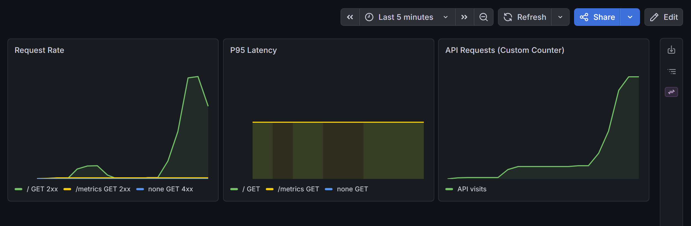

# InfraWatch 🔭

> Sistema de observabilidad cloud-native (self-hosted) para aplicaciones containerizadas,
> con monitorización en tiempo real, alertas automatizadas, CI/CD y seguridad integrada.


---

## Stack Tecnológico

| Capa | Tecnologías |
|------|-------------|
| **Backend** | Python 3.11 + FastAPI |
| **Bases de datos** | PostgreSQL 16, Redis 7 |
| **Contenedores** | Docker, Docker Compose |
| **Monitorización** | Prometheus, Grafana |
| **Alerting** | Alertmanager + Slack |
| **CI/CD** | GitHub Actions |
| **Seguridad** | Trivy (escaneo de vulnerabilidades) |

---

## Arquitectura

```
Cliente → Nginx (8080) → FastAPI (8000) → PostgreSQL  (persistencia)
                                        → Redis       (caché)

Prometheus (9090) ←── scrape /metrics ──→ FastAPI
                 ──→ Alertmanager (9093) ──→ Slack (#alerts-infra)
Grafana    (3000) ←── datasource      ──→ Prometheus

7 servicios orquestados con Docker Compose en red interna aislada.
```

---

## Cómo ejecutar

```bash
git clone https://github.com/alejandro-pastor/Infrawatch.git
cd Infrawatch
# Asegúrate de tener un archivo .env con las variables de entorno configuradas
docker-compose up -d --build
```

| Puerto | Servicio |
|--------|----------|
| `8000` | FastAPI (API REST) |
| `9090` | Prometheus |
| `3000` | Grafana |
| `8080` | Nginx (reverse proxy) |
| `9093` | Alertmanager (alerting) |

> **Nota:** Las credenciales se gestionan mediante variables de entorno (`.env`).
> Nunca se incluyen en el repositorio.

---

## Pipeline CI/CD

Cada `push` a `main` ejecuta automáticamente:

1. **Build** de la imagen Docker
2. **Tests** con pytest — verifica endpoints, JSON y resiliencia ante fallos de Redis/PostgreSQL
3. **Escaneo de seguridad** con Trivy — severidad `CRITICAL` provoca fallo del pipeline (`exit-code: 1`)
4. **Push a Docker Hub** (`pastorops/infrawatch`) — solo si tests y escaneo pasan

Este flujo implementa el principio **Shift-Left Security**: las vulnerabilidades se detectan
y bloquean antes de que la imagen llegue a producción.

---

## Dashboard Grafana

El panel de control incluye tres métricas principales:

- **Request Rate** — Peticiones por segundo (`rate()`)
- **P95 Latency** — Latencia en el percentil 95
- **API Requests** — Contador acumulado de llamadas a la API



---

## Alerting

El sistema incluye alertas automatizadas que monitorizan la salud de la API en tiempo real:

| Alerta | Severidad | Condición | Duración |
|--------|-----------|-----------|----------|
| `APIDown` | 🔴 CRITICAL | API no responde (up == 0) | > 2 minutos |
| `HighLatency` | 🟡 WARNING | P95 latencia > 2 segundos | > 5 minutos |
| `LowRequestRate` | 🟡 WARNING | Peticiones casi 0 pero API arriba | > 10 minutos |

### Flujo de alertas

```
Prometheus (evalúa reglas) → Alertmanager (deduplica + agrupa) → Slack (#alerts-infra)
```

**Configuración:**
- **Canal de Slack:** `#alerts-infra`
- **Resolución:** Notificación automática cuando el problema se resuelve (`send_resolved: true`)
- **Agrupación:** Por `alertname` y `severity` para evitar spam
- **Reenvío:** Cada 4h si la alerta no se resuelve

Las reglas están definidas en `rules/fastapi-alerts.yml` y la configuración de Alertmanager en `alertmanager.yml` (este último en `.gitignore` por contener el webhook URL).

---

## Seguridad

- **Trivy en pipeline:** bloquea el despliegue ante vulnerabilidades críticas
- **Imagen optimizada:** `python:3.11-slim` con `perl-base` eliminado → CVEs críticos reducidos a 0
- **Gestión de secretos:** variables de entorno con `.env` + GitHub Secrets para el pipeline
- **Principio de mínimo privilegio** aplicado en todos los tokens de acceso
- **Webhook URL protegido:** `alertmanager.yml` está en `.gitignore` para evitar exposición del secreto de Slack

---

## Tests

La API incluye 5 tests automatizados:

| Test | Tipo | Qué verifica |
|------|------|-------------|
| `test_health` | Smoke test | `/health` responde 200 con `{"status": "healthy"}` |
| `test_root_status` | Smoke test | `/` responde 200 siempre |
| `test_root_json_fields` | Estructural | El JSON contiene `status`, `total_api_requests` y `database_connected` |
| `test_root_without_redis` | Resiliencia | La API responde 200 aunque Redis esté caído |
| `test_root_without_db` | Resiliencia | La API responde 200 aunque PostgreSQL esté caído |

Los tests se ejecutan automáticamente en cada `push` a `main` vía GitHub Actions, **antes** del escaneo de seguridad y del despliegue.

---

## Estado del proyecto

> 🚧 Proyecto en desarrollo activo

| Funcionalidad | Estado |
|---------------|--------|
| Stack base (FastAPI + PostgreSQL + Redis) | ✅ Completado |
| Contenedorización con Docker Compose | ✅ Completado |
| Pipeline CI/CD con GitHub Actions | ✅ Completado |
| Escaneo de seguridad con Trivy | ✅ Completado |
| Monitorización con Prometheus + Grafana | ✅ Completado |
| Nginx como proxy inverso | ✅ Completado |
| Alertas automáticas con Alertmanager + Slack | ✅ Completado |
| Tests automatizados con pytest | ✅ Completado |
| Despliegue en Oracle Cloud (Free Tier) | ❌ Pospuesto — sin capacidad ARM disponible |
| Logs centralizados con Grafana Loki | 🔜 Próximo |
| Métricas de PostgreSQL y Redis | 🔜 Próximo |


---

## Autor

**Alejandro Pastor** — [github.com/alejandro-pastor](https://github.com/alejandro-pastor) · [LinkedIn](https://www.linkedin.com/in/alejandro-pastor-devops)
